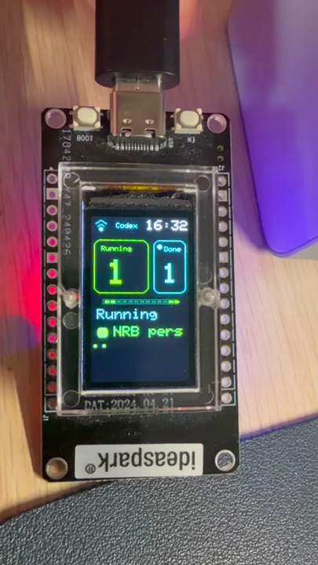

# Codex Status Display

A tiny ESP32 + ST7789 desk display for local Codex chat status.

It shows only the signals that are useful when Codex is working in the background:

- `Running`: active Codex chats.
- `Done`: recently completed chats that have not been marked as seen.
- `Response needed`: running chats that are waiting for user input, highlighted in the running list.



## How It Works

```text
Codex local state -> Python bridge -> compact JSON -> USB serial or WiFi HTTP -> ESP32 screen
```

The Python bridge reads local Codex state from `~/.codex/state_5.sqlite` and Codex session JSONL logs. It does not read private app cache or IndexedDB state.

The ESP32 firmware can receive the compact JSON payload in two ways:

- USB serial: useful for first bring-up and debugging.
- WiFi HTTP polling: useful for daily use on a desk.

The default WiFi refresh interval in the firmware is 10 seconds.

## Repository Layout

```text
.
|-- codex_status_display.py
|-- firmware/esp32_st7789_serial/
|   |-- esp32_st7789_serial.ino
|   `-- wifi_config.example.h
|-- tests/
`-- docs/
```

## Host Bridge

Run once and print the compact JSON payload:

```bash
python3 codex_status_display.py
```

Serve the payload over WiFi/LAN:

```bash
python3 codex_status_display.py --http --watch --interval 10
```

Write one payload over USB serial:

```bash
python3 codex_status_display.py --serial /dev/cu.wchusbserial11120
```

Mark currently visible completed chats as seen:

```bash
python3 codex_status_display.py --mark-seen
```

Runtime state is written under:

```text
local-runtime/codex-status-display/
```

This folder is intentionally ignored by git.

## ESP32 Firmware

The included firmware targets an ESP32 Dev Module with an ST7789 display:

```text
Display: ST7789
Size: 135 x 240
Rotation: 0
CS: 15
RST: 4
DC: 2
Serial: 115200
```

Arduino libraries used:

- `Adafruit_GFX`
- `Adafruit_ST7789`
- `ArduinoJson`

USB-only mode needs no WiFi file.

For WiFi mode, copy:

```text
firmware/esp32_st7789_serial/wifi_config.example.h
```

to:

```text
firmware/esp32_st7789_serial/wifi_config.h
```

Then fill in your local SSID, password, and host URL. The real `wifi_config.h` is ignored by git.

Example URL:

```cpp
#define CODEX_STATUS_URL "http://192.168.0.10:8787/wire"
```

## Arduino Build

Example with Arduino CLI:

```bash
arduino-cli compile --fqbn esp32:esp32:esp32 firmware/esp32_st7789_serial
arduino-cli upload --fqbn esp32:esp32:esp32 --port /dev/cu.wchusbserial11120 firmware/esp32_st7789_serial
```

## Tests

```bash
python3 -m unittest discover -s tests
```

## Notes

This is a personal maker project, not an official OpenAI or Codex product. It is intentionally local-first: your Codex state stays on your machine, and the ESP32 receives only a compact status summary.
