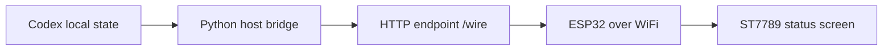

# 把 Codex 运行状态装进一块 ESP32 小屏：从 USB 串口到 WiFi 状态面板


视频演示：`assets/codex-status-display-demo.mp4`

## 问题从哪里来

我在使用 Codex 做多线程任务时，遇到一个很日常但很真实的问题：任务在后台跑着，我不想一直盯着电脑窗口，但又希望知道两件事：

1. 现在有没有 chat 还在运行。
2. 有没有 chat 已经完成，但我还没有打开看。
3. 如果某个 running chat 正在等我回复或点击选择，也应该明显提醒我。

所以这个项目的目标不是做一个完整的任务管理系统，而是做一个小小的「周边感知设备」：把 Codex 当前最需要我注意的状态放到桌面小屏上。

## 硬件和约束

这次使用的是一块带 ST7789 小屏的 ESP32 板子。最开始我误以为是 ESP32-S3 USB Serial/JTAG 板，后来实际识别为通过 WCH/CH340 暴露串口的普通 ESP32 板，所以最终按 `ESP32 Dev Module` 烧录。

屏幕参数沿用了我之前的 Arduino 天气项目：

```text
Display: ST7789
Size: 135 x 240
Rotation: 0
CS: 15
RST: 4
DC: 2
Serial: 115200
```

第一版约束很明确：

- 不读取 Codex App 私有 IndexedDB/cache。
- 不把 WiFi 密码、API 密钥等敏感信息写进文章或共享文件。
- Host 端只读取本机稳定状态。
- 小屏只显示高价值提醒，不做复杂 dashboard。

## 第一次误区：我以为我要看“任务”，其实我要看“chat”

最早的 host bridge 读的是本地任务清单、automation 状态和 review 队列，所以屏幕上出现过 `APPROVE 92` 这种数字。这个数字本身不是错的，但语义错了：它不是“有 92 个 Codex chat 等我确认”，而是某个 review/candidate 队列里的数量。

这个误区很关键。真正对这个小屏有价值的不是所有本地任务，而是 Codex chat 的状态：

- `Running`：还在运行的 Codex chat。
- `Done`：最近完成但我还没读的 Codex chat。
- `Response needed`：仍在 running，但当前等待我回复、选择或点击继续的 chat。

于是状态模型被收敛为两块主信息：

```text
RUNNING: 正在运行的 chat 数量
DONE: 完成但未读的 chat 数量

Running 列表中：
绿色 = 正常运行
橙红色 = 需要我响应
```

## Host bridge：本机状态转成小屏能读的 JSON

Host 端是一个 Python bridge，位于：

```text
services/codex-status-display/codex_status_display.py
```

它读取 Codex 本机状态和 session rollout 日志，把复杂状态压缩成一个小于 1 KB 的 JSON payload。屏幕只需要理解这个简化协议。

示意结构如下：

```json
{
  "updated_at": "2026-05-02T16:20:00Z",
  "counts": {
    "running_projects": 1,
    "done_unseen": 1,
    "awaiting_response": 0
  },
  "projects": [
    {
      "name": "Codex status display",
      "status": "running"
    }
  ],
  "completed": [
    {
      "name": "WiFi firmware upload",
      "status": "done_unseen"
    }
  ]
}
```

这里有一个重要取舍：我希望“打开 chat 后自动消失”，但目前没有找到稳定、公开、可依赖的本地已读字段。因此 V1/V2 保留了一个本地兜底文件：

```text
local-runtime/codex-status-display/seen-chat-completions.json
```

也就是说，完成未读状态可以先可靠显示，再通过本地 `--mark-seen` 机制清除，避免误把还没看的完成项自动隐藏。

## 屏幕 UI 的几次迭代

第一版界面有三个框：

- Running
- Done
- Approve

但这很快暴露出两个问题：

1. 字太小，小屏上阅读成本很高。
2. `Approve` 这个词误导了真实含义。

后来我把界面改成更接近纸面草图的布局：

- 顶部：WiFi 图标、`Codex`、当前时间。
- 中部：两个大卡片，左边 `Running`，右边 `Done`。
- 底部：running chat 列表。
- 列表颜色表达状态：绿色代表普通运行，橙红色代表需要我 response。

这样小屏的职责变得非常清楚：它不是解释所有细节，而是在桌面上给我一个“现在要不要看一眼 Codex”的信号。

## 从 USB 串口到 WiFi

USB 版本的工作方式是：

```text
Mac bridge -> USB serial -> ESP32 -> ST7789 screen
```

它很适合调试，但实际使用时，小屏一直拖着线并不舒服。所以后面改成 WiFi 模式：



现在 Mac 上运行一个本地 HTTP 服务：

```bash
python3 services/codex-status-display/codex_status_display.py \
  --root /Users/wyb/Documents/Codex_project/Robin_AIagent_v2 \
  --http \
  --http-host 0.0.0.0 \
  --http-port 8787 \
  --watch \
  --interval 10 \
  --quiet
```

ESP32 固件里配置同一个局域网的 host 地址，然后每 10 秒请求一次：

```text
http://<Mac 局域网 IP>:8787/wire
```

这里不是实时推送，而是轻量轮询。10 秒对这个场景足够了：状态提醒不会有明显延迟，同时也不会给小板或电脑造成负担。

## 最终显示逻辑

我最后保留下来的信息只有三类：

```text
Running 数字
Done 未读数字
Running chat 列表
```

其中 `Response needed` 不再单独占一个大卡片，而是融入 running 列表：

- 绿色行：chat 正在跑。
- 橙红色行：chat 正在等我回复。
- Running 区域保留像素动画，表示它不是静态截图，而是在持续刷新。

Done 的含义也被重新定义得更窄：不是“所有完成的 chat”，而是“最近完成、但本地还没有标记已读的 chat”。

## 这个小屏真正解决的是什么

它不是为了显示更多信息，而是为了减少我反复切回 Codex 的次数。

当它显示：

- `Running > 0`：说明后台还有活。
- `Done > 0`：说明刚才交给 Codex 的事情已经结束，可以去看结果。
- 列表里出现橙红色：说明 Codex 在等我，不处理它就会卡住。

这其实是一个很小的 agent peripheral display：把 AI agent 的运行状态从电脑窗口里抽出来，变成桌面环境的一部分。

## 下一步

我后面想继续做三件事：

1. 找到更稳定的“已读”信号，尽量实现打开 chat 后自动清除 Done。
2. 给 response-needed 状态增加更明显但不刺眼的动画。
3. 把这个状态协议整理成可复用模板，让其他小屏或桌面设备也能接入。

这次最有价值的经验是：小屏幕产品的难点不在“显示更多”，而在“删掉大部分不该显示的东西”。当状态语义收敛以后，硬件和 UI 都变得简单了。
